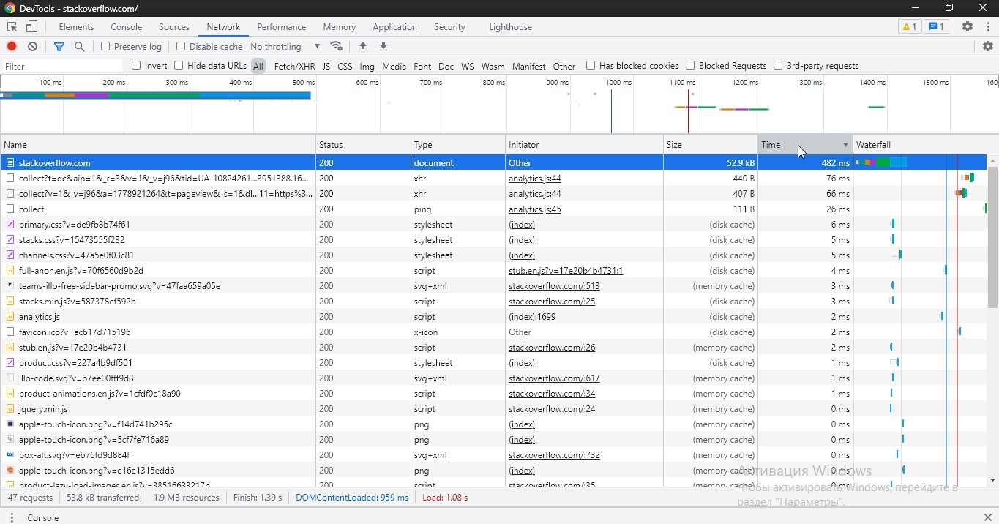
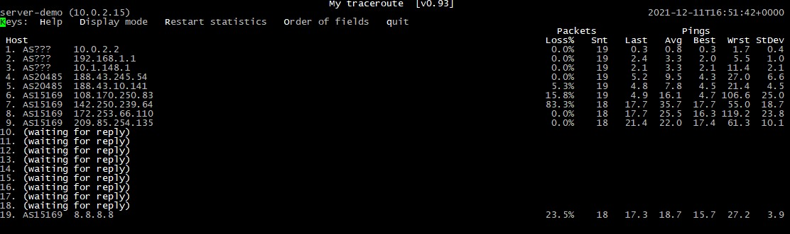

# Домашнее задание к занятию "3.6. Компьютерные сети, лекция 1"
## Проценко Анастасия

1. Код состояния HTTP 301 или Moved Permanently (Перемещено навсегда) — стандартный код ответа HTTP, получаемый в ответ от сервера в ситуации, когда запрошенный ресурс был на постоянной основе перемещён в новое месторасположение, и указывающий на то, что текущие ссылки, использующие данный URL, должны быть обновлены.
```
HTTP/1.1 301 Moved Permanently
cache-control: no-cache, no-store, must-revalidate
location: https://stackoverflow.com/questions
x-request-guid: 3b85aad4-c3aa-408d-9ab8-179c412832bc
feature-policy: microphone 'none'; speaker 'none'
content-security-policy: upgrade-insecure-requests; frame-ancestors 'self' https://stackexchange.com
Accept-Ranges: bytes
Date: Sat, 11 Dec 2021 15:40:01 GMT
Via: 1.1 varnish
Connection: close
X-Served-By: cache-ams21076-AMS
X-Cache: MISS
X-Cache-Hits: 0
X-Timer: S1639237201.466322,VS0,VE75
Vary: Fastly-SSL
X-DNS-Prefetch-Control: off
Set-Cookie: prov=341824f9-91ee-3d08-56d5-a10b9b56f51e; domain=.stackoverflow.com; expires=Fri, 01-Jan-2055 00:00:00 GMT; path=/; HttpOnly

Connection closed by foreign host.
```
2. `Status Code: 307 Internal Redirect`
Дольше всего обрабатывался запрос на получение документа.


3. Свой IP адрес в интрнете можно узнать с помощью команды `curl 2ip.ru`.
4. Узнать какому провайдеру принадлежит мой IP адрес можно с помощью команды  `whois 'my ip'` в поле `address`; автономную систему AS - в поле `origin`. Также можно сразу воспользоваться утилитой `grep`.
5. Через какие сети и AS проходит пакет, отправленный на адрес 8.8.8.8, можно узнать с помощью команды `traceroute -An 8.8.8.8 -I`.
```
traceroute to 8.8.8.8 (8.8.8.8), 30 hops max, 60 byte packets
 1  10.0.2.2 [*]  0.254 ms  0.229 ms  0.129 ms
 2  192.168.1.1 [*]  2.702 ms  3.511 ms  3.604 ms
 3  10.1.148.1 [*]  7.544 ms  7.780 ms  7.887 ms
 4  188.43.245.54 [AS20485]  13.904 ms  13.776 ms  13.694 ms
 5  188.43.10.141 [AS20485]  13.605 ms  13.990 ms  14.295 ms
 6  * 108.170.250.83 [AS15169]  5.718 ms  5.827 ms
 7  * 142.250.239.64 [AS15169]  43.489 ms *
 8  172.253.66.110 [AS15169]  43.340 ms  43.409 ms  43.242 ms
 9  209.85.254.135 [AS15169]  42.134 ms  41.448 ms  41.340 ms
10  * * *
11  * * *
12  * * *
13  * * *
14  * * *
15  * * *
16  * * *
17  * * *
18  * * *
19  * 8.8.8.8 [AS15169]  26.635 ms  26.931 ms
```
6. Использовала команду `mtr -zn 8.8.8.8`

Наибольшая задержка происходит на ip 142.250.239.64.

7. Использую команду `dig dns.google`

```
; <<>> DiG 9.16.1-Ubuntu <<>> dns.google
;; QUESTION SECTION:
;dns.google.                    IN      A

;; ANSWER SECTION:
dns.google.             845     IN      A       8.8.8.8
dns.google.             845     IN      A       8.8.4.4
```

8. Использую команду для первого адреса `dig -x 8.8.8.8`

```
; <<>> DiG 9.16.1-Ubuntu <<>> -x 8.8.8.8
;; global options: +cmd
;; Got answer:
;; ->>HEADER<<- opcode: QUERY, status: NOERROR, id: 39125
;; flags: qr rd ra; QUERY: 1, ANSWER: 1, AUTHORITY: 0, ADDITIONAL: 1

;; OPT PSEUDOSECTION:
; EDNS: version: 0, flags:; udp: 65494
;; QUESTION SECTION:
;8.8.8.8.in-addr.arpa.          IN      PTR

;; ANSWER SECTION:
8.8.8.8.in-addr.arpa.   86400   IN      PTR     dns.google.

;; Query time: 220 msec
;; SERVER: 127.0.0.53#53(127.0.0.53)
;; WHEN: Sat Dec 11 17:28:28 UTC 2021
;; MSG SIZE  rcvd: 73
```
для второго адреса `dig -x 8.8.4.4`

```
; <<>> DiG 9.16.1-Ubuntu <<>> -x 8.8.4.4
;; global options: +cmd
;; Got answer:
;; ->>HEADER<<- opcode: QUERY, status: NOERROR, id: 59313
;; flags: qr rd ra; QUERY: 1, ANSWER: 1, AUTHORITY: 0, ADDITIONAL: 1

;; OPT PSEUDOSECTION:
; EDNS: version: 0, flags:; udp: 65494
;; QUESTION SECTION:
;4.4.8.8.in-addr.arpa.          IN      PTR

;; ANSWER SECTION:
4.4.8.8.in-addr.arpa.   86400   IN      PTR     dns.google.

;; Query time: 256 msec
;; SERVER: 127.0.0.53#53(127.0.0.53)
;; WHEN: Sat Dec 11 17:30:35 UTC 2021
;; MSG SIZE  rcvd: 73
```
