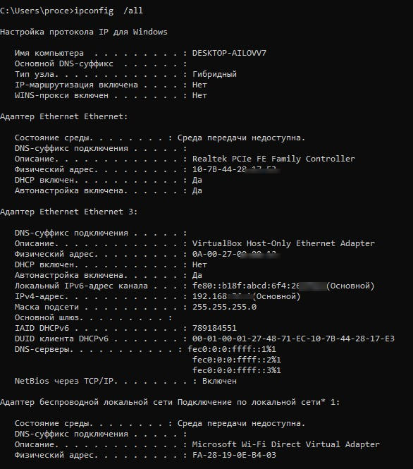
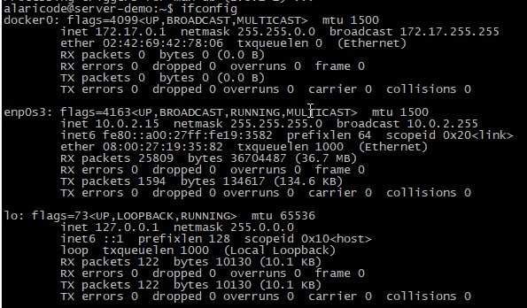
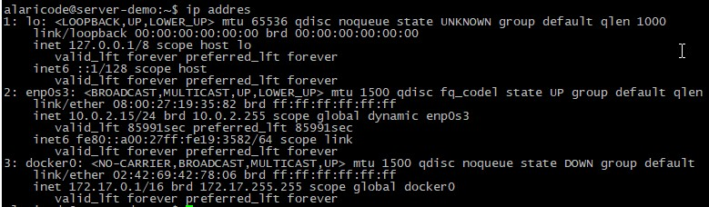

# Домашнее задание к занятию "3.7. Компьютерные сети, лекция 2"
## Проценко Анастасия

1. В Windows это `ipconfig /all`

В Linux:
*`ifconfig`

*`ip addres`

2. Пакеты в разных дистрибутивах называются по-разному, но обычно это `lldpd`. Команда для поиска `lldpctl`.
3. Для разбиения одной сети на несколько виртуальных используется технология VLAN.

Пакеты поддержки VLAN для разных Linux-дистрибутивов называются по-разному, в Linux это пакет vlan, а где-то и просто vconfig.
Пример конфига для 10-ого VLAN интерфейсе eth1:
```
auto eth1.10
iface eth1.10 inet static
        address 192.168.1.1
        netmask 255.255.255.0
        vlan_raw_device eth1
```
4. Используют два варианта агрегации - bonding и teaming.

У bonding есть опции для балансировки нагрузки:
* `mode=0 (balance-rr)`
Последовательно кидает пакеты, с первого по последний интерфейс.

* `mode=1 (active-backup)`
Один из интерфейсов активен. Если активный интерфейс выходит из строя (link down и т.д.),
другой интерфейс заменяет активный. Не требует дополнительной настройки коммутатора

* `mode=2 (balance-xor)`
Передачи распределяются между интерфейсами на основе формулы
((MAC-адрес источника) XOR (MAC-адрес получателя)) % число интерфейсов.
Один и тот же интерфейс работает с определённым получателем. Режим даёт балансировку нагрузки и отказоустойчивость.

* `mode=3 (broadcast)`
Все пакеты на все интерфейсы

* `mode=4 (802.3ad)`
Link Agregation — IEEE 802.3ad, требует от коммутатора настройки.

* `mode=5 (balance-tlb)`
Входящие пакеты принимаются только активным сетевым интерфейсом, исходящий распределяется
в зависимости от текущей загрузки каждого интерфейса. Не требует настройки коммутатора.

* `mode=6 (balance-alb)`
Тоже самое что 5, только входящий трафик тоже распределяется между интерфейсами. Не требует
настройки коммутатора, но интерфейсы должны уметь изменять MAC.

У teaming:

* `Automatic (Recommended`) — это не самостоятельный тип настройки. Этот тип выбирает между
Transmit Load Balancing (TLB) или 802.3ad Dynamic.

* `Network Fault Tolerance Only (NFT)` — в режиме NFT от 2 до 8 портов объединены вместе.
Однако только один порт (primary port) используется для приема и передачи данных. Остальные порты
находятся в режиме standby. Если основной порт выходит из строя, то другой порт заменяет его.
Этот режим работает во всех остальных типах NIC teaming.

* `Network Fault Tolerance Only with Preference Order Network` — аналогичен типу NFT. Единственное
отличие заключается в том, что этот тип позволяет административно назначить порядок, в котором порты будут становиться основными.

* `Switch-assisted Load Balancing with Fault Tolerance (SLB)` — позволяет балансировать нагрузку для входящего
и исходящего трафика. 

* `Transmit Load Balancing with Fault Tolerance (TLB)` — позволяет серверу балансировать исходящий трафик.
TLB не зависит от коммутатора и позволяет портам в team быть подключенными к разным коммутаторам в одной и той же сети.
Входящий трафик не балансируется.

* `Transmit Load Balancing with Fault Tolerance and Preference Order` — аналогичен типу TLB. Единственное отличие
заключается в том, что этот тип позволяет административно назначить порядок в котором порты будут становиться основными.

Пример конфига для bonding:
```
auto bond0

iface bond0 inet static
    address 10.31.1.5
    netmask 255.255.255.0
    network 10.31.1.0
    gateway 10.31.1.254
    bond-slaves eth0 eth1
    bond-mode active-backup
    bond-miimon 100
    bond-downdelay 200
    bond-updelay 200
```
5. В сети с маской /29 8 IP-адресов.

Из сети с маской /24 можно получить 32 сети с маской /29

Примеры подсетей с маской /29, полученных из сети 10.10.10.0/24:
* 10.10.10.0/29
* 10.10.10.8/29
* 10.10.10.16/29

6. Подсеть для организации стыка - `100.64.0.0/26`.
7. Посмотреть ARP-таблицу в Linux можно командной -  `arp`, Windows - `arp -a`.

Очистка ARP-кэша в Linux:
```
ip link set arp off dev eth0 ; ip link set arp on dev eth0
```
Очистка ARP-кэша в windows:
```
netsh interface ip delete arpcache
```
ARP-запись можно удалять через `arp -d`:
```
arp -i eth1 -d 10.0.0.1
```
