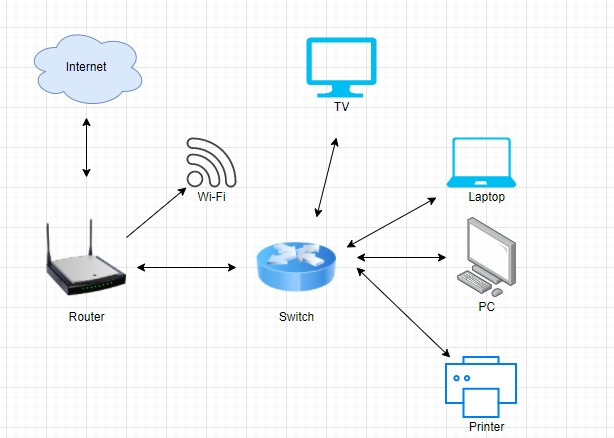

# Домашнее задание к занятию "3.8. Компьютерные сети, лекция 3"
## Проценко Анастасия

1. * Запрос IP маршрута:
```
route-views>show ip route 37.xxx.xxx.xxx
Routing entry for 37.xxx.xxx.xxx/16
  Known via "bgp 6447", distance 20, metric 0
  Tag 6939, type external
  Last update from 64.71.137.241 4d08h ago
  Routing Descriptor Blocks:
  * 64.71.137.241, from 64.71.137.241, 4d08h ago
      Route metric is 0, traffic share count is 1
      AS Hops 3
      Route tag 6939
      MPLS label: none
```
* Запрос BGP:
```
route-views>show bgp 37.xxx.xxx.xxx
BGP routing table entry for 37.xxx.xxx.xxx/16, version 1413946865
Paths: (23 available, best #22, table default)
  Not advertised to any peer
  Refresh Epoch 1
  20912 3257 1299 9049 31200, (aggregated by 31200 10.245.140.238)
    212.66.96.126 from 212.66.96.126 (212.66.96.126)
      Origin IGP, localpref 100, valid, external
      Community: 3257:8101 3257:30055 3257:50001 3257:53900 3257:53902 20912:65004
      path 7FE02EFC6410 RPKI State valid
      rx pathid: 0, tx pathid: 0
  Refresh Epoch 1
  3333 1103 12389 31200, (aggregated by 31200 10.245.140.238)
    193.0.0.56 from 193.0.0.56 (193.0.0.56)
      Origin IGP, localpref 100, valid, external
      path 7FE18AE09CA8 RPKI State valid
      rx pathid: 0, tx pathid: 0
  Refresh Epoch 1
  8283 1299 9049 31200, (aggregated by 31200 10.245.140.238)
    94.142.247.3 from 94.142.247.3 (94.142.247.3)
      Origin IGP, metric 0, localpref 100, valid, external
      Community: 1299:30000 8283:1 8283:101 8283:103
      unknown transitive attribute: flag 0xE0 type 0x20 length 0x24
        value 0000 205B 0000 0000 0000 0001 0000 205B
              0000 0005 0000 0001 0000 205B 0000 0005
              0000 0003
      path 7FE081041AB8 RPKI State valid
      rx pathid: 0, tx pathid: 0
  Refresh Epoch 1
  3549 3356 9002 9002 9002 9002 9002 9049 31200, (aggregated by 31200 10.245.140.238)
    208.51.134.254 from 208.51.134.254 (67.16.168.191)
      Origin IGP, metric 0, localpref 100, valid, external
      Community: 3356:2 3356:22 3356:100 3356:123 3356:503 3356:901 3356:2067 3549:2581 3549:30840
      path 7FE1186A30D8 RPKI State valid
      rx pathid: 0, tx pathid: 0
  Refresh Epoch 1
  57866 9002 9049 31200, (aggregated by 31200 10.245.140.238)
    37.139.139.17 from 37.139.139.17 (37.139.139.17)
      Origin IGP, metric 0, localpref 100, valid, external
      Community: 9002:0 9002:64667
      path 7FE03AEB8E40 RPKI State valid
      rx pathid: 0, tx pathid: 0
  Refresh Epoch 1
  3356 9002 9002 9002 9002 9002 9049 31200, (aggregated by 31200 10.245.140.238)
    4.68.4.46 from 4.68.4.46 (4.69.184.201)
      Origin IGP, metric 0, localpref 100, valid, external
 --More--
```
2. Добавила dummy0:
```
root@server-demo:/home/alaricode# ip link add dummy0 type dummy
root@server-demo:/home/alaricode# ip addr add 10.1.2.3/32 dev dummy0
```
Проверяем:
```
root@server-demo:/home/alaricode# ip link
1: lo: <LOOPBACK,UP,LOWER_UP> mtu 65536 qdisc noqueue state UNKNOWN mode DEFAULT group default qlen 1000
    link/loopback 00:00:00:00:00:00 brd 00:00:00:00:00:00
2: enp0s3: <BROADCAST,MULTICAST,UP,LOWER_UP> mtu 1500 qdisc fq_codel state UP mode DEFAULT group default qlen 1000
    link/ether 08:00:27:19:35:82 brd ff:ff:ff:ff:ff:ff
3: docker0: <NO-CARRIER,BROADCAST,MULTICAST,UP> mtu 1500 qdisc noqueue state DOWN mode DEFAULT group default
    link/ether 02:42:40:ad:21:79 brd ff:ff:ff:ff:ff:ff
4: dummy0: <BROADCAST,NOARP> mtu 1500 qdisc noop state DOWN mode DEFAULT group default qlen 1000
    link/ether 3e:9b:7a:7a:bb:f1 brd ff:ff:ff:ff:ff:ff
```
Добавляем маршруты:
```
root@server-demo:/home/alaricode# ip route add 1.1.1.0/24 via 10.0.2.5
root@server-demo:/home/alaricode# ip route add 1.1.0.0/16 via 10.0.2.6
root@server-demo:/home/alaricode# ip route add 1.0.0.0/8 via 10.0.2.7
```
Проверяем итог:
```
root@server-demo:/home/alaricode# ip route
default via 10.0.2.2 dev enp0s3 proto dhcp src 10.0.2.15 metric 100
1.0.0.0/8 via 10.0.2.7 dev enp0s3
1.1.0.0/16 via 10.0.2.6 dev enp0s3
1.1.1.0/24 via 10.0.2.5 dev enp0s3
10.0.2.0/24 dev enp0s3 proto kernel scope link src 10.0.2.15
10.0.2.2 dev enp0s3 proto dhcp scope link src 10.0.2.15 metric 100
172.17.0.0/16 dev docker0 proto kernel scope link src 172.17.0.1 linkdown
```
3. Смотрим TCP-порты и открывшие их приложения:
```
root@server-demo:/home/alaricode# ss -tpan
State     Recv-Q    Send-Q       Local Address:Port        Peer Address:Port     Process
LISTEN    0         4096         127.0.0.53%lo:53               0.0.0.0:*         users:(("systemd-resolve",pid=640,fd=13))
LISTEN    0         128                0.0.0.0:22               0.0.0.0:*         users:(("sshd",pid=708,fd=3))
ESTAB     0         0                10.0.2.15:22              10.0.2.2:61997     users:(("sshd",pid=1281,fd=4),("sshd",pid=1204,fd=4))
ESTAB     0         0                10.0.2.15:22              10.0.2.2:56681     users:(("sshd",pid=1167,fd=4),("sshd",pid=1035,fd=4))
LISTEN    0         128                   [::]:22                  [::]:*         users:(("sshd",pid=708,fd=4))
```
* 22 порт - SSH (используется sshd)
* 53 порт - DNS (используется systemd-resolve)

4. Проверяем используемые UDP сокеты
```
root@server-demo:/home/alaricode# ss -upan
State      Recv-Q     Send-Q             Local Address:Port           Peer Address:Port     Process
UNCONN     0          0                  127.0.0.53%lo:53                  0.0.0.0:*         users:(("systemd-resolve",pid=640,fd=12))
UNCONN     0          0               10.0.2.15%enp0s3:68                  0.0.0.0:*         users:(("systemd-network",pid=638,fd=19))
```
* 53 порт - DNS (используется systemd-resolve)
* 68 порт - клиентский порт для DHCP

5. Пример L3 диаграммы:


