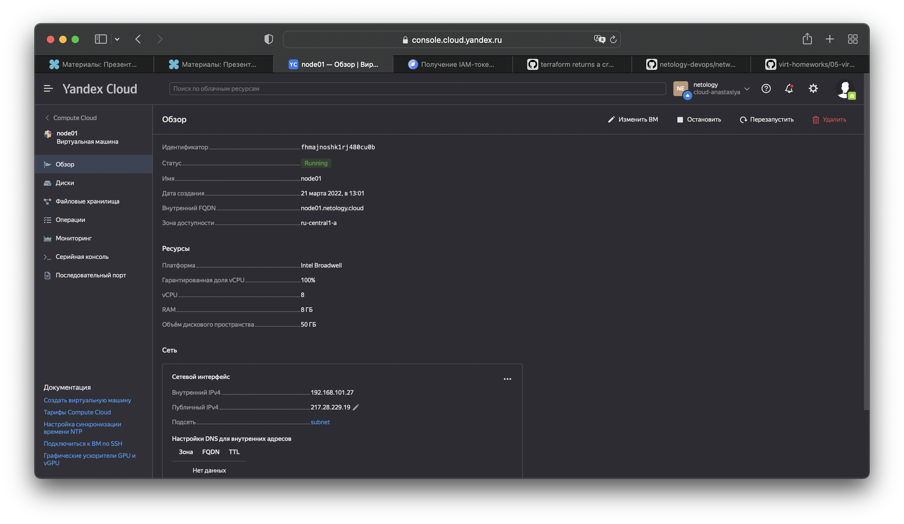
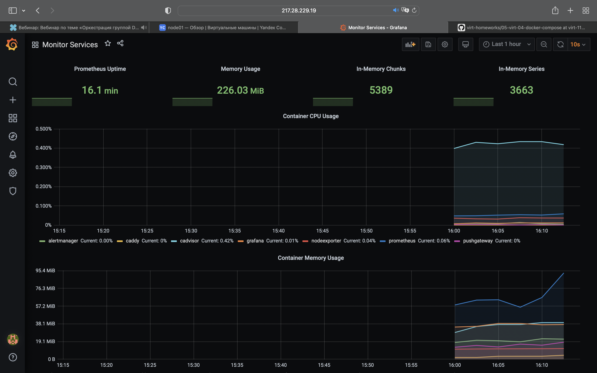

# Домашнее задание к занятию "5.4. Оркестрация группой Docker контейнеров на примере Docker Compose"

## Проценко Анастасии
---

## Задача 1
Создала собственный образ операционной системы с помощью Packer.

## Задача 2
Создала виртуальную машину в Яндекс.Облаке.

## Задача 3
Создала готовый к боевой эксплуатации компонент мониторинга, состоящий из стека микросервисов.

