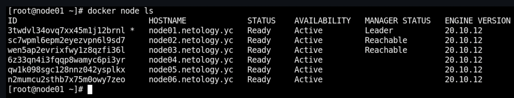

# Домашнее задание к занятию "5.5. Оркестрация кластером Docker контейнеров на примере Docker Swarm"

## Проценко Анастасия
---

## Задача 1

**В чём отличие режимов работы сервисов в Docker Swarm кластере: replication и global?**  
+ При **replication** режиме по нодам раскидывается такое количество копий сервиса, что указано в количестве реплик.  

+ При **global** режиме на все доступные ноды попадает по одной копии сервиса.

----

**Какой алгоритм выбора лидера используется в Docker Swarm кластере?**  
+ Алгоритм **Raft**

----

**Что такое Overlay Network?**  
+ **Overlay Network** - распределённая виртуальная сеть между хостами с docker'ом. Существует поверх реальных сетей, 
подключенных к конкретным докер-нодам. Служит для прозрачного и безопасного обмена данными и 
управляющими командами между докер-контейнерами кластера. Маршрутизация данных автоматическая 
(конечному пользователю с ней заморачиваться не нужно).

## Задача 2

```
docker node ls
```  


## Задача 3
```
docker service ls
``` 

