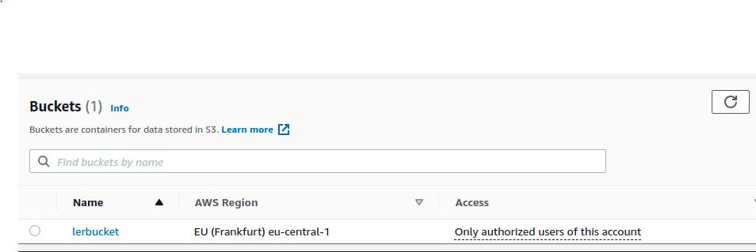
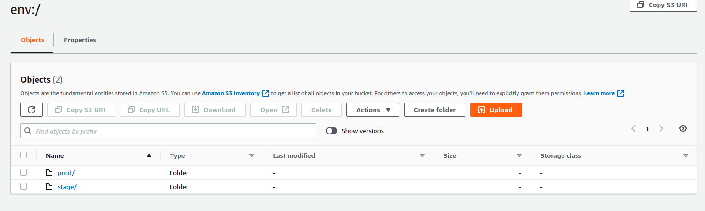

# Домашнее задание к занятию "7.3. Основы и принцип работы Терраформ"
## Проценко Анастасии

## Задача 1. Создадим бэкэнд в S3
Bucket:  
 

***`Permissions:`***

```bash
{
   "Version": "2012-10-17",
   "Statement": [
       {
           "Effect": "Allow",
           "Principal": {
               "AWS": "*"
           },
           "Action": "s3:ListBucket",
           "Resource": "arn:aws:s3:::lerbucket"
       },
       {
           "Effect": "Allow",
           "Principal": {
               "AWS": "*"
           },
           "Action": [
               "s3:GetObject",
               "s3:PutObject"
           ],
           "Resource": "arn:aws:s3:::lerbucket/*"
       }
   ]
}
```
***`Access Point policy (bucket)`***
```bash
{
    "Version": "2012-10-17",
    "Statement": [
        {
            "Effect": "Allow",
            "Principal": {
                "AWS": "arn:aws:iam::---:root"
            },
            "Action": "s3:ListBucket",
            "Resource": "arn:aws:s3:eu-central-1:---:accesspoint/<namepoint>"
        },
        {
            "Effect": "Allow",
            "Principal": {
                "AWS": "arn:aws:iam::---:root"
            },
            "Action": [
                "s3:GetObject",
                "s3:PutObject"
            ],
            "Resource": "arn:aws:s3:eu-central-1:---:accesspoint/<namepoint>/object/<iam role>/*"
        }
    ]
}
````
***`versions.tf`***
```bash
terraform {
  backend "s3" {
      bucket = "lerbucket"
      key = "s3/terraform.tfstate"
      region = "eu-central-1"
      dynamodb_table = "tstate-locks"
  }

  required_providers {
    aws = {
      source  = "hashicorp/aws"
      version = "~> 3.0"
    }
  }
}
```
## Задача 2. Инициализируем проект и создаем воркспейсы.
1. Выполните `terraform init:` если был создан бэкэнд в S3, то терраформ создат файл стейтов в S3 и запись в таблице dynamodb.
```bash
$ terraform init

Initializing the backend...

Successfully configured the backend "s3"! Terraform will automatically
use this backend unless the backend configuration changes.

Initializing provider plugins...
- Reusing previous version of hashicorp/aws from the dependency lock file
- Using previously-installed hashicorp/aws v3.63.0

Terraform has been successfully initialized!

You may now begin working with Terraform. Try running "terraform plan" to see
any changes that are required for your infrastructure. All Terraform commands
should now work.

If you ever set or change modules or backend configuration for Terraform,
rerun this command to reinitialize your working directory. If you forget, other
commands will detect it and remind you to do so if necessary.
```
```bash
$ terraform apply

Terraform used the selected providers to generate the following execution plan. Resource actions are indicated with the following symbols:
  + create

Terraform will perform the following actions:

  # aws_dynamodb_table.terraform_locks will be created
  + resource "aws_dynamodb_table" "terraform_locks" {
      + arn              = (known after apply)
      + billing_mode     = "PAY_PER_REQUEST"
      + hash_key         = "LockID"
      + id               = (known after apply)
      + name             = "tstate-locks"
      + stream_arn       = (known after apply)
      + stream_label     = (known after apply)
      + stream_view_type = (known after apply)
      + tags_all         = (known after apply)

      + attribute {
          + name = "LockID"
          + type = "S"
        }

      + point_in_time_recovery {
          + enabled = (known after apply)
        }

      + server_side_encryption {
          + enabled     = (known after apply)
          + kms_key_arn = (known after apply)
        }
    }

  # aws_instance.web will be created
  + resource "aws_instance" "web" {
      + ami                                  = "ami-0a49b025fffbbdac6"
      + arn                                  = (known after apply)
      + associate_public_ip_address          = (known after apply)
      + availability_zone                    = (known after apply)
      + cpu_core_count                       = (known after apply)
      + cpu_threads_per_core                 = (known after apply)
      + disable_api_termination              = (known after apply)
      + ebs_optimized                        = (known after apply)
      + get_password_data                    = false
      + host_id                              = (known after apply)
      + id                                   = (known after apply)
      + instance_initiated_shutdown_behavior = (known after apply)
      + instance_state                       = (known after apply)
      + instance_type                        = "t3.micro"
      + ipv6_address_count                   = (known after apply)
      + ipv6_addresses                       = (known after apply)
      + key_name                             = (known after apply)
      + monitoring                           = (known after apply)
      + outpost_arn                          = (known after apply)
      + password_data                        = (known after apply)
      + placement_group                      = (known after apply)
      + placement_partition_number           = (known after apply)
      + primary_network_interface_id         = (known after apply)
      + private_dns                          = (known after apply)
      + private_ip                           = (known after apply)
      + public_dns                           = (known after apply)
      + public_ip                            = (known after apply)
      + secondary_private_ips                = (known after apply)
      + security_groups                      = (known after apply)
      + source_dest_check                    = true
      + subnet_id                            = (known after apply)
      + tags                                 = {
          + "Name" = "HelloWorld"
        }
      + tags_all                             = {
          + "Name" = "HelloWorld"
        }
      + tenancy                              = (known after apply)
      + user_data                            = (known after apply)
      + user_data_base64                     = (known after apply)
      + vpc_security_group_ids               = (known after apply)

      + capacity_reservation_specification {
          + capacity_reservation_preference = (known after apply)

          + capacity_reservation_target {
              + capacity_reservation_id = (known after apply)
            }
        }

      + ebs_block_device {
          + delete_on_termination = (known after apply)
          + device_name           = (known after apply)
          + encrypted             = (known after apply)
          + iops                  = (known after apply)
          + kms_key_id            = (known after apply)
          + snapshot_id           = (known after apply)
          + tags                  = (known after apply)
          + throughput            = (known after apply)
          + volume_id             = (known after apply)
          + volume_size           = (known after apply)
          + volume_type           = (known after apply)
        }

      + enclave_options {
          + enabled = (known after apply)
        }

      + ephemeral_block_device {
          + device_name  = (known after apply)
          + no_device    = (known after apply)
          + virtual_name = (known after apply)
        }

      + metadata_options {
          + http_endpoint               = (known after apply)
          + http_put_response_hop_limit = (known after apply)
          + http_tokens                 = (known after apply)
        }

      + network_interface {
          + delete_on_termination = (known after apply)
          + device_index          = (known after apply)
          + network_interface_id  = (known after apply)
        }

      + root_block_device {
          + delete_on_termination = (known after apply)
          + device_name           = (known after apply)
          + encrypted             = (known after apply)
          + iops                  = (known after apply)
          + kms_key_id            = (known after apply)
          + tags                  = (known after apply)
          + throughput            = (known after apply)
          + volume_id             = (known after apply)
          + volume_size           = (known after apply)
          + volume_type           = (known after apply)
        }
    }

  # aws_s3_bucket.terraform_state will be created
  + resource "aws_s3_bucket" "terraform_state" {
      + acceleration_status         = (known after apply)
      + acl                         = "private"
      + arn                         = (known after apply)
      + bucket                      = "lerbucket"
      + bucket_domain_name          = (known after apply)
      + bucket_regional_domain_name = (known after apply)
      + force_destroy               = false
      + hosted_zone_id              = (known after apply)
      + id                          = (known after apply)
      + region                      = (known after apply)
      + request_payer               = (known after apply)
      + tags_all                    = (known after apply)
      + website_domain              = (known after apply)
      + website_endpoint            = (known after apply)

      + versioning {
          + enabled    = (known after apply)
          + mfa_delete = (known after apply)
        }
    }

  # aws_vpc.example will be created
  + resource "aws_vpc" "example" {
      + arn                              = (known after apply)
      + assign_generated_ipv6_cidr_block = false
      + cidr_block                       = "10.0.0.0/16"
      + default_network_acl_id           = (known after apply)
      + default_route_table_id           = (known after apply)
      + default_security_group_id        = (known after apply)
      + dhcp_options_id                  = (known after apply)
      + enable_classiclink               = (known after apply)
      + enable_classiclink_dns_support   = (known after apply)
      + enable_dns_hostnames             = (known after apply)
      + enable_dns_support               = true
      + id                               = (known after apply)
      + instance_tenancy                 = "default"
      + ipv6_association_id              = (known after apply)
      + ipv6_cidr_block                  = (known after apply)
      + main_route_table_id              = (known after apply)
      + owner_id                         = (known after apply)
      + tags_all                         = (known after apply)
    }

Plan: 4 to add, 0 to change, 0 to destroy.

Changes to Outputs:
  + account_id         = "---"
  + caller_arn         = "arn:aws:iam::---:root"
  + caller_user        = "---"
  + instance_id        = (known after apply)
  + instance_ip_addr   = (known after apply)
  + instance_public_ip = (known after apply)

Do you want to perform these actions?
  Terraform will perform the actions described above.
  Only 'yes' will be accepted to approve.

  Enter a value: yes

aws_vpc.example: Creating...
aws_dynamodb_table.terraform_locks: Creating...
aws_s3_bucket.terraform_state: Creating...
aws_instance.web: Creating...
aws_instance.web: Still creating... [10s elapsed]
aws_instance.web: Still creating... [20s elapsed]
aws_instance.web: Creation complete after 25s [id=i-0652246193d7f822d]
Outputs:

account_id = "---"
caller_arn = "arn:aws:iam::---:root"
caller_user = "---"
instance_id = "i-06522461---822d"
instance_ip_addr = "172.--.8.29"
instance_public_ip = "18.--.22.169"

```
2. Создайте два воркспейса stage и prod.
```bash
$ terraform workspace new stage
Created and switched to workspace "stage"!

You're now on a new, empty workspace. Workspaces isolate their state,
so if you run "terraform plan" Terraform will not see any existing state
for this configuration.
```
```bash
$ terraform workspace new prod
Created and switched to workspace "prod"!

You're now on a new, empty workspace. Workspaces isolate their state,
so if you run "terraform plan" Terraform will not see any existing state
for this configuration.
```
```bash
$ terraform workspace list
  default
* prod
  stage
```
3. В уже созданный aws_instance добавьте зависимость типа инстанса от вокспейса, что бы в разных ворскспейсах использовались разные instance_type.  
4. Добавим count. Для stage должен создаться один экземпляр ec2, а для prod два.
5. Создайте рядом еще один aws_instance, но теперь определите их количество при помощи for_each, а не count.  
6. Чтобы при изменении типа инстанса не возникло ситуации, когда не будет ни одного инстанса добавьте параметр жизненного цикла create_before_destroy = true в один из рессурсов aws_instance.  

Объявим переменные:
`variables.tf`
```bash
variable "aws-region" {
  default = "eu-central-1"
  description = "Default Amazon region"
}

variable "web_instance_type_map" {
  type = map
  default = {
    "stage" = "t3.micro"
    "prod" = "t3.large"
  }

} 

variable "web_instance_count_map" {
  type = map
  default = {
    "stage" = 1
    "prod" = 2
  }
} 


variable "web_instance_map" {
 type = map(object({
   name = string
   count  = number
 }))
 description = "Instance Type"
}
```
Проинициализируем `Map'y`
`terraform.tfvars`
```bash
  web_instance_map = {
    "stage" = {
      name = "t3.micro"
      count = 1
    },
    
    "prod" = {
      name = "t3.large"
      count = 2
    }
  }
```
Использование переменных
`main.tf`
```bash
# Configure the AWS Provider

provider "aws" {
  region  = "eu-central-1"
  allowed_account_ids = ["---"]
  shared_credentials_file = "$HOME/.aes/credentials"
  profile = "******"
}


data "aws_ami" "ubuntu" {
  most_recent = true

  filter {
    name   = "name"
    values = ["ubuntu/images/hvm-ssd/ubuntu-focal-20.04-amd64-server-*"]
  }

  filter {
    name   = "virtualization-type"
    values = ["hvm"]
  }

  owners = ["099720109477"] # Canonical

}

locals {
    environment = terraform.workspace
}


resource "aws_instance" "test" {
  ami          		 = data.aws_ami.ubuntu.id
  instance_type 	 = lookup(var.web_instance_type_map, local.environment)
  count            = lookup(var.web_instance_count_map, local.environment)

  tags = {
    Name = "test"
  }
}

resource "aws_instance" "test2" {
  for_each = var.web_instance_map
  ami = data.aws_ami.ubuntu.id
  instance_type = each.value.name


  lifecycle {
    create_before_destroy = true
  }

  tags = {
    Name = "test2 ${each.value.name}"
  }
}
```
`terraform plan` для prod
```terraform
$ terraform plan
Acquiring state lock. This may take a few moments...

Terraform used the selected providers to generate the following execution plan. Resource actions are indicated with the following symbols:
  + create

Terraform will perform the following actions:
 # aws_instance.test2["prod"] will be created
  + resource "aws_instance" "test2" {
      + ami                                  = "ami-0a49b025fffbbdac6"
      + arn                                  = (known after apply)
      + associate_public_ip_address          = (known after apply)
      + availability_zone                    = (known after apply)
      + cpu_core_count                       = (known after apply)
      + cpu_threads_per_core                 = (known after apply)
      + disable_api_termination              = (known after apply)
      + ebs_optimized                        = (known after apply)
      + get_password_data                    = false
      + host_id                              = (known after apply)
      + id                                   = (known after apply)
      + instance_initiated_shutdown_behavior = (known after apply)
      + instance_state                       = (known after apply)
      + instance_type                        = "t3.large"
      + ipv6_address_count                   = (known after apply)
      + ipv6_addresses                       = (known after apply)
      + key_name                             = (known after apply)
      + monitoring                           = (known after apply)
      + outpost_arn                          = (known after apply)
      + password_data                        = (known after apply)
      + placement_group                      = (known after apply)
      + placement_partition_number           = (known after apply)
      + primary_network_interface_id         = (known after apply)
      + private_dns                          = (known after apply)
      + private_ip                           = (known after apply)
      + public_dns                           = (known after apply)
      + public_ip                            = (known after apply)
      + secondary_private_ips                = (known after apply)
      + security_groups                      = (known after apply)
      + source_dest_check                    = true
      + subnet_id                            = (known after apply)
      + tags                                 = {
          + "Name" = "test2 t3.large"
        }
      + tags_all                             = {
          + "Name" = "test2 t3.large"
        }
      + tenancy                              = (known after apply)
      + user_data                            = (known after apply)
      + user_data_base64                     = (known after apply)
      + vpc_security_group_ids               = (known after apply)

      + capacity_reservation_specification {
          + capacity_reservation_preference = (known after apply)

          + capacity_reservation_target {
              + capacity_reservation_id = (known after apply)
            }
        }

      + ebs_block_device {
          + delete_on_termination = (known after apply)
          + device_name           = (known after apply)
          + encrypted             = (known after apply)
          + iops                  = (known after apply)
          + kms_key_id            = (known after apply)
          + snapshot_id           = (known after apply)
          + tags                  = (known after apply)
          + throughput            = (known after apply)
          + volume_id             = (known after apply)
          + volume_size           = (known after apply)
          + volume_type           = (known after apply)
        }

      + enclave_options {
          + enabled = (known after apply)
        }

      + ephemeral_block_device {
          + device_name  = (known after apply)
          + no_device    = (known after apply)
          + virtual_name = (known after apply)
        }

      + metadata_options {
          + http_endpoint               = (known after apply)
          + http_put_response_hop_limit = (known after apply)
          + http_tokens                 = (known after apply)
        }

      + network_interface {
          + delete_on_termination = (known after apply)
          + device_index          = (known after apply)
          + network_interface_id  = (known after apply)
        }

      + root_block_device {
          + delete_on_termination = (known after apply)
          + device_name           = (known after apply)
          + encrypted             = (known after apply)
          + iops                  = (known after apply)
          + kms_key_id            = (known after apply)
          + tags                  = (known after apply)
          + throughput            = (known after apply)
          + volume_id             = (known after apply)
          + volume_size           = (known after apply)
          + volume_type           = (known after apply)
        }
    }
Plan: 4 to add, 0 to change, 0 to destroy.

Changes to Outputs:
  + account_id  = "---"
  + caller_arn  = "arn:aws:iam::---:root"
  + caller_user = "---"
  ```
 
 

