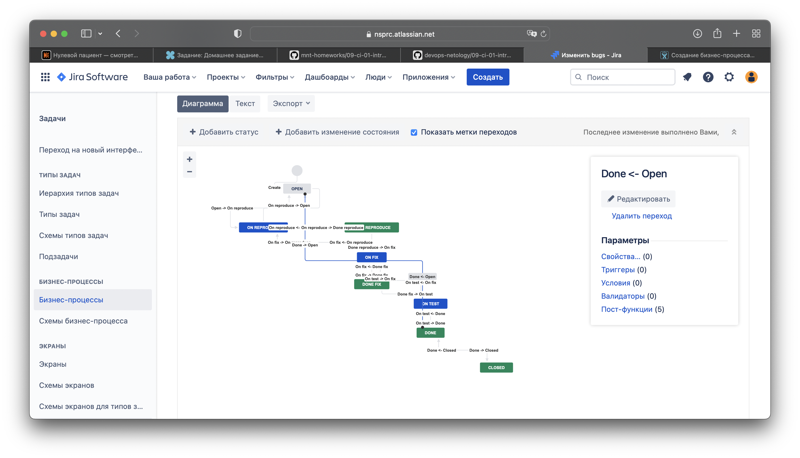
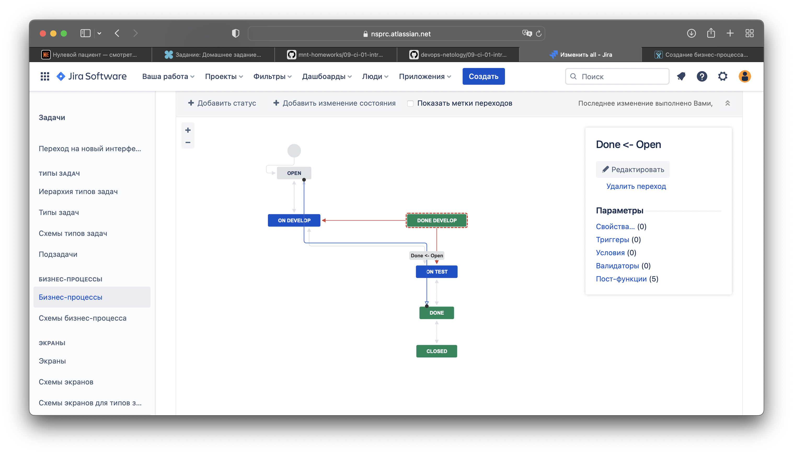

# Домашнее задание к занятию "09.01 Жизненный цикл ПО"
## Проценко Анастасия
## Подготовка к выполнению
1. *Получить бесплатную [JIRA](https://www.atlassian.com/ru/software/jira/free)*
2. *Настроить её для своей "команды разработки"*
3. *Создать доски kanban и scrum*

## Основная часть
*В рамках основной части необходимо создать собственные workflow для двух типов задач: bug и остальные типы задач. Задачи типа bug должны проходить следующий жизненный цикл:*
1. *Open -> On reproduce*
2. *On reproduce <-> Open, Done reproduce*
3. *Done reproduce -> On fix*
4. *On fix <-> On reproduce, Done fix*
5. *Done fix -> On test*
6. *On test <-> On fix, Done*
7. *Done <-> Closed, Open*

**Выполнено:**  

*Остальные задачи должны проходить по упрощённому workflow:*
1. *Open -> On develop*
2. *On develop <-> Open, Done develop*
3. *Done develop -> On test*
4. *On test <-> On develop, Done*
5. *Done <-> Closed, Open*

**Выполнено:**  

