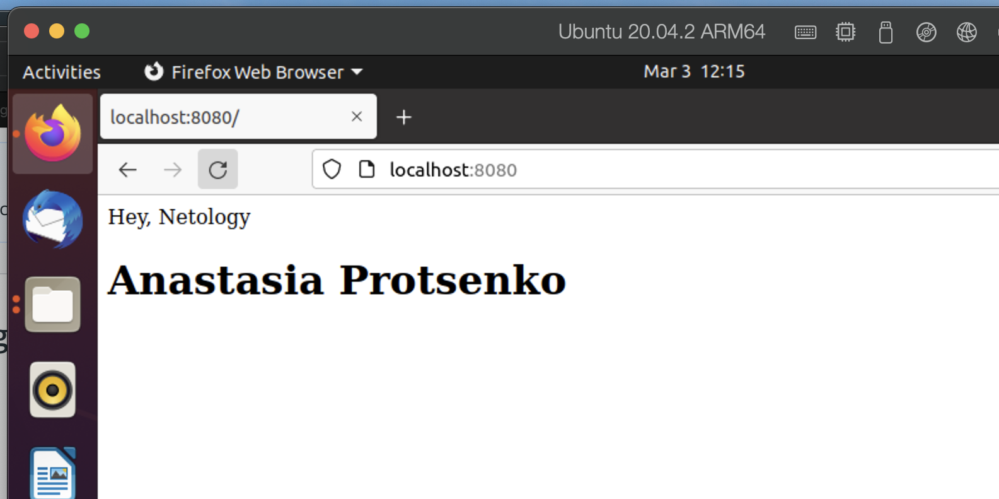
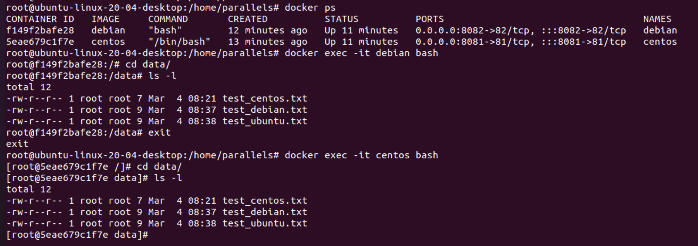

# Домашнее задание к занятию "5.3. Введение. Экосистема. Архитектура. Жизненный цикл Docker контейнера"

## Проценко Анастасии
---

## Задача 1
  
Мой репозиторий на hub.docker.com ```https://hub.docker.com/repository/docker/procenkoanastasia/netology-devops```

Загружаем образ nginx, заходим в контейнер
```bash
docker run -it --rm -d -p 8080:80 --name web ngnix
docker exec -it web bash
vi /usr/share/nginx/html/index.html
```
Редактируем файл **index.html** со следующим содержимым:  
```html
<html>
<head>
Hey, Netology
</head>
<body>
<h1>Anastasia Protsenko</h1>
</body>
</html>
```
Делаем коммит и пушим в наш репо:
```bash
docker container commit web procenkoanastasia/netology-dovops:tagname
docker push procenkoanastasia/netology-devops:tagname
docker restart web
```
И видим в браузере результат



## Задача 2

**Высоконагруженное монолитное java веб-приложение**  

Docker для монолита не имеет смысла. Если приложение имеет высокую нагрузку, то физический сервер - чтобы имелся физ.доступ к ресурсам.

**Nodejs веб-приложение**  

Docker здесь является оптимальным вариантом. Минимум накладных расходов + прост в  управления.

**Мобильное приложение c версиями для Android и iOS**  

Запуск мобильных приложений под разные аппаратные платформы будет проще осуществить на виртуалке.

**Шина данных на базе Apache Kafka**  

Docker подойдет для контейнерой реализации.

**Elasticsearch кластер для реализации логирования продуктивного веб-приложения - три ноды elasticsearch, два logstash и две ноды kibana**  

Использование Docker предпочтительно, но можно и на виртуалках (отказоустойчиваость на уровне кластера будет проще решаться)

**Мониторинг-стек на базе Prometheus и Grafana**

Docker-контейнеры с Grafana и Prometheus, это подходящее решение для докеризации.

**MongoDB, как основное хранилище данных для java-приложения**

БД с данными в контейнере хранить не cтоит.
Виртуалка отлично подходит.


**Gitlab сервер для реализации CI/CD процессов и приватный (закрытый) Docker Registry.**

Виртуалка с точки зрения упрощения администрирования и возможного аварийного восстановления. 

## Задача 3

Запускаем первый контейнер из образа ***centos***, подключив папку ```/data``` из текущей рабочей директории на хостовой машине в ```/data``` контейнера;
```
docker run -v /homep/paralells:/data -it -p 8081:81 --name centos centos
```

Запускаем второй контейнер из образа ***debian***, подключив папку ```/data``` ;
```
docker run -v /homep/paralells:/data -it -p 8082:82 --name debian debian
```

Подключаемся к каждому из контйнеров и создаем соответсвующие файлы в папку ```/data```.


