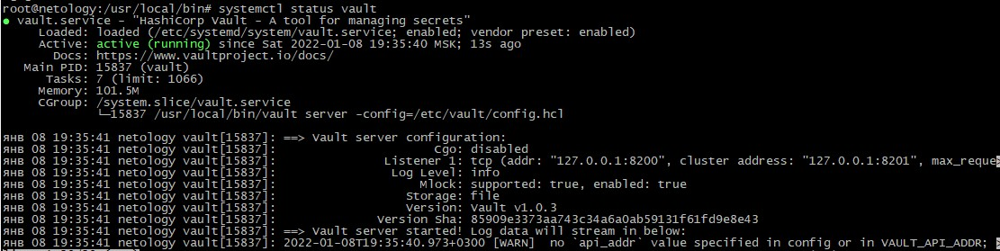
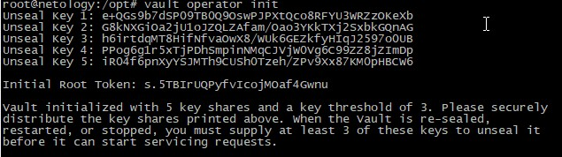
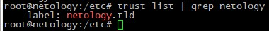
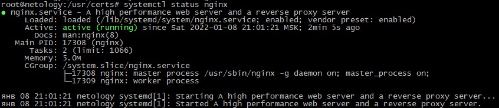
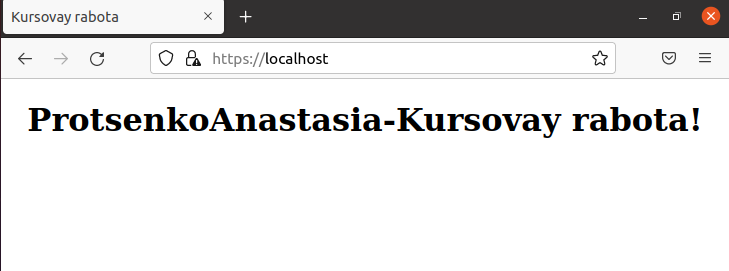
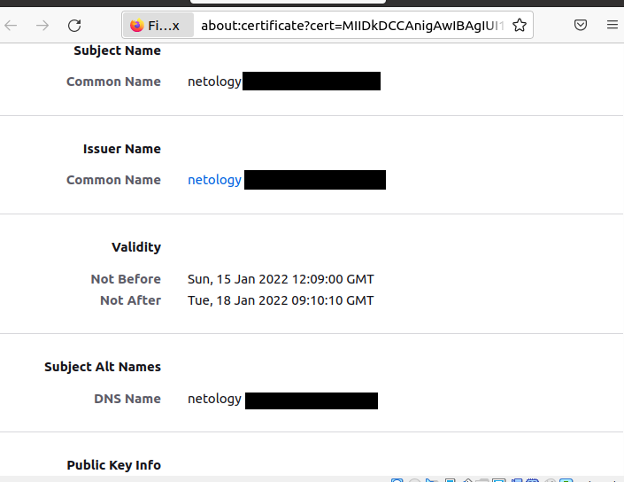
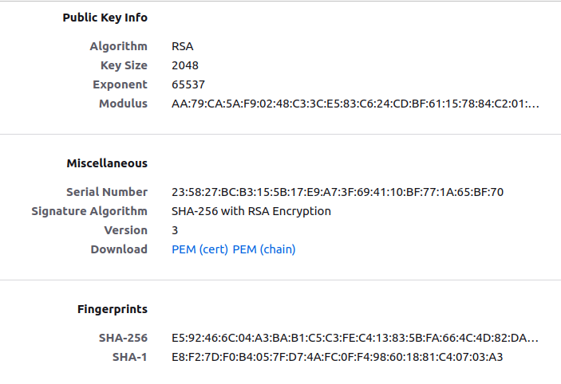

# Курсовая работа по итогам модуля "DevOps и системное администрирование"
## Прценко Анастасии
=======================================================================

Пункт 1
-------

*Создайте виртуальную машину Linux.*

### Создание виртуалки
+ Установка Linux Ubuntu на VM
+ Меняем SSH-ключи на несовпадающие с шаблоном:  
```bash
rm -f /etc/ssh/ssh_host*
ssh-keygen -A
```

Пункт 2
-------

*Установите* ***ufw*** *и разрешите к этой машине сессии на порты 22 и 443, при этом трафик на  
интерфейсе* ***localhost (lo)*** *должен ходить свободно на все порты.*  
  

+ Установка **ufw** 
`apt install ufw`

Все входящие пакеты будем отклонять:

`ufw default deny incoming`

А все исходящие разрешим:

`ufw default allow outgoing`

Открываем порты ufw для SSH: `ufw allow 443/tcp` и `ufw allow 22/tcp`

Задача 3
--------
*Установите* ***hashicorp vault***  
  
### Установка Hashicorp Vault
``` 
VAULT_VERSION="1.0.3"
curl -sO https://releases.hashicorp.com/vault/${VAULT_VERSION}/vault_${VAULT_VERSION}_linux_amd64.zip
```

+ Извлекаем загруженный архив.
```
unzip vault_${VAULT_VERSION}_linux_amd64.zip
sudo cp vault /usr/local/bin/
```
+ Проверка версии
```
$ vault --version
Vault v1.0.3 ('85909e3373aa743c34a6a0ab59131f61fd9e8e43')
```
+ Включаем автозаполнение команды.
```
vault -autocomplete-install
complete -C /usr/local/bin/vault vault
```

+ Настройка службы Vault systemd
Создаем каталоги данных Vault.
```
sudo mkdir /etc/vault
sudo mkdir -p /var/lib/vault/data
```
+ Затем создаем пользователя с именем vault.
```
sudo useradd --system --home /etc/vault --shell /bin/false vault
sudo chown -R vault:vault /etc/vault /var/lib/vault/
```
+ Создайем файл службы Vault в `/etc/systemd/system/vault.service`

```
cat <<EOF | sudo tee /etc/systemd/system/vault.service
[Unit]
Description="HashiCorp Vault - A tool for managing secrets"
Documentation=https://www.vaultproject.io/docs/
Requires=network-online.target
After=network-online.target
ConditionFileNotEmpty=/etc/vault/config.hcl

[Service]
User=vault
Group=vault
ProtectSystem=full
ProtectHome=read-only
PrivateTmp=yes
PrivateDevices=yes
SecureBits=keep-caps
AmbientCapabilities=CAP_IPC_LOCK
NoNewPrivileges=yes
ExecStart=/usr/local/bin/vault server -config=/etc/vault/config.hcl
ExecReload=/bin/kill --signal HUP 
KillMode=process
KillSignal=SIGINT
Restart=on-failure
RestartSec=5
TimeoutStopSec=30
StartLimitBurst=3
LimitNOFILE=65536

[Install]
WantedBy=multi-user.target
EOF
```

+ Затем создаем конфиг Vault `/etc/vault/config.hcl`

```
# Full configuration options can be found at https://www.vaultproject.io/docs/configuration

ui = false

#mlock = true
#disable_mlock = true

storage "file" {
  path = "/opt/vault/data"
}

# HTTP listener
listener "tcp" {
  address = "127.0.0.1:8200"
  tls_disable = 1
}

# HTTPS listener
#listener "tcp" {
#  address       = "127.0.0.1:8200"
#  tls_cert_file = "/opt/vault/tls/tls.crt"
#  tls_key_file  = "/opt/vault/tls/tls.key"
#}
```
+ Запускаем и включаем службу vault для запуска при загрузке системы.
```
sudo systemctl daemon-reload
sudo systemctl enable --now vault
```


Задача 4
--------
*Cоздайте центр сертификации по инструкции (ссылка) и выпустите сертификат для использования его  
в настройке веб-сервера* ***nginx*** *(срок жизни сертификата - месяц).*  
  
### Подготовка
  
+ Cтавим вспомогательную утилиту **jq** для парсинга JSON-данных:  
```bash
apt  install jq
```
  
### Инициализация Vault-сервера
  
+ Заходим через SSH на второй экземпляр терминала нашей виртуалки  
  
+ Экспортируем переменную с адресом сервера нашего vault'а:  
```bash
export VAULT_ADDR=http://127.0.0.1:8200
```
  
+ Инициализируем волт:  
```bash
vault operator init
```
+ Увидим что-то вроде этого:  

  
+ Переписываем содержимое ключей в файлы **/vaultkeys/\*.key**  
  
+ Переписываем содержимое root-токена в файл **vaultkeys/root_token**  
  
### Разблокировка волта
  
+ Для разблокировки волта запускаем скрипт **vault_unseal.sh** со следующим содержимым:  
```bash
#!/usr/bin/env bash

# Разблочиваем хранилище содержимым первых трех файлов с ключами
#
# Ключи лежат в файлах vaultkeys/*.key
# задаём метод доступа и адрес волта
export VAULT_ADDR='http://127.0.0.1:8200'

vault operator unseal $(cat vaultkeys/1.key)
vault operator unseal $(cat vaultkeys/2.key)
vault operator unseal $(cat vaultkeys/3.key)
```
  
+ Следом запускаем скрипт **vault_login.sh** со следующим содержимым:  
```bash
#!/usr/bin/env bash

export VAULT_ADDR='http://127.0.0.1:8200'

vault login $(cat vaultkeys/root_token)
```
  
### Генерируем корневой сертификат
  
+ Запускаем скрипт генерации корневого сертификата:  
**gen_CA_cert.sh**  
```bash
#!/usr/bin/env bash

###################################
# Генерация корневого сертификата #
###################################

#Имя домена
DOMAIN=netology.tld

#Максимальное время жизни корневого сертификата (ставим на 10 лет)
MAXTTL=87600h

#Время жизни нашего сертификата
TTL=87600h

export VAULT_ADDR='http://127.0.0.1:8200'

#Включаем pki движок
vault secrets enable pki

#максимальное время жизни корневого сертификата
vault secrets tune -max-lease-ttl=$MAXTTL pki

#Генерим корневой сертификат в certs/CA_cert.crt
vault write -field=certificate pki/root/generate/internal common_name=$DOMAIN ttl=$TTL > certs/CA_cert.crt

#Конфигурируем пути для CA-сертификата и CRL (Certificate Revocation List)
vault write pki/config/urls issuing_certificates="$VAULT_ADDR/v1/pki/ca" crl_distribution_points="$VAULT_ADDR/v1/pki/crl"
```
  
+ Результат будет лежать в файле **certs/CA_cert.crt**
  
### Генерируем промежуточный сертификат
  
+ Запускаем скрипт генерации промежуточного сертификата:  
**gen_Int_cert.sh**  
```bash
#!/usr/bin/env bash

########################################################
# Генерация промежуточного сертификата                 #
########################################################

#Домен, для которого генерируется промежуточный сертификат
DOMAIN=netology.tld

# Максимальное время жизни промежуточного сертификата (задаём 5 лет)
MAXTTL=43800h

# Время жизни промежуточного сертификата
TTL=43800h

# Задаём метод доступа и адрес волта
export VAULT_ADDR='http://127.0.0.1:8200'

# переходим в подкаталог certs для упрощения жизни
cd certs

# включаем PKI движок для pki_int пути
vault secrets enable -path=pki_int pki

# максимальное время жизни промежуточных сертификатов
vault secrets tune -max-lease-ttl=$MAXTTL pki_int

# генерируем промежуточный сертификат и сохраняем Certificate Signing Request в cert/pki_intermediate.csr
vault write -format=json pki_int/intermediate/generate/internal common_name="$DOMAIN Intermediate Authority" | jq -r '.data.csr' > pki_intermediate.csr

# подписываем промежуточный сертификат приватным ключом root CA и записываем результат в cert/intermediate.cert.pem
vault write -format=json pki/root/sign-intermediate csr=@pki_intermediate.csr format=pem_bundle ttl=$TTL | jq -r '.data.certificate' > intermediate.cert.pem

# импортируем промежуточный сертификат
vault write pki_int/intermediate/set-signed certificate=@intermediate.cert.pem
```
  
+ Результат будет лежать в файле **certs/intermediate.cert.pem**
  
### Создаём роль
*Фактически создаётся политика безопасности для конкретного домена и его поддоменов.*  
  
+ Запускаем скрипт генерации роли:  
**gen_role.sh**  
```bash
#!/usr/bin/env bash

###########################################
# Генерация ролей для домена и поддоменов #
###########################################

# Имя домена
DOMAIN=netology.tld

# Срок жизни сертификата (ставим в 1 месяц)
TTL=720h

# Задаём метод доступа и адрес волта
export VAULT_ADDR='http://127.0.0.1:8200'

# Заменяем в имени домена точки на _dot_ для получения имени роли
ROLENAME=${DOMAIN//./_dot_}

echo $ROLENAME > rolenames/$DOMAIN

# создаём роль для домена со сроком жизни сертификата в месяц и разрешением на использование субдоменов
vault write pki_int/roles/$ROLENAME allowed_domains="$DOMAIN" allow_subdomains=true max_ttl="$TTL"
```
  
### Генерируем сертификат для конкретного домена
  
+ Запускаем скрипт генерации конечного сертификата:  
**gen_cert.sh**  
```bash
#!/usr/bin/env bash

#############################################
# Генерация сертификата под конкретный сайт #
#############################################

# Имя домена
DOMAIN=netology.tld

# Имя роли
ROLENAME=netology_dot_tld

# Срок действия сертификата
TTL=720h

# Задаём метод доступа и адрес волта
export VAULT_ADDR='http://127.0.0.1:8200'

# Генерим сертификат и выдаём результат в JSON для дальнейшего парсинга
RESULT=$(vault write -format=json pki_int/issue/$ROLENAME common_name="$DOMAIN" ttl="$TTL")

# Извлекаем серийный номер сертификата и пишем его в certs/end_cert.sn
jq -r '.data.serial_number' <<< "$RESULT" > certs/end_cert.sn

# Извлекаем срок годности сертификата и пишем его в certs/end_cert_exp_date
EXPDATE=$(jq '.data.expiration' <<< "$RESULT")
# Пишем в юникс-формате
echo "Unix format: $EXPDATE" > certs/end_cert_exp_date
# Пишем в человекочитаемом виде
echo $(date -d @$EXPDATE) >> certs/end_cert_exp_date

# Выбираем сам сертификат и пишем его в certs/end_cert.crt
jq -r '.data.certificate' <<< "$RESULT" > certs/end_cert.crt

# Выбираем цепочку доверия и пишем её в certs/end_ca_chain
jq -r '.data.ca_chain[]' <<< "$RESULT" > certs/end_ca_chain

# Выбираем issuing_ca и пишем его в certs/end_issuing_ca.crt
jq -r '.data.issuing_ca' <<< "$RESULT" > certs/end_issuing_ca.crt

# Выбираем приватный ключ и пишем его в certs/end_private_key.pem
jq -r '.data.private_key' <<< "$RESULT" > certs/end_private_key.pem

# Выбираем тип приватного ключа и пишем его в certs/end_private_key_type
jq -r '.data.private_key_type' <<< "$RESULT" > certs/end_private_key_type
```
  
Результат (ключи, сертификаты, серийники, даты) получим в папке **certs**.
  
Задача 5
--------
*Установите корневой сертификат созданного центра сертификации в доверенные в хостовой системе*  
  
+ Устанавливаем сертификат в доверенные:  
)

Задача 6
--------
*Установите* ***nginx***
  
### Установка nginx
  
+ Установка
```bash
apt install nginx
```
  
+ Запускаем сервис:  
```bash
systemctl enable nginx
systemctl start nginx
```
  
### Проверка на работоспособность
  
+ Проверяем сервис:  
```bash
systemctl status nginx
```
Получаем следующее:  



Задача 7
--------
*настройте nginx на https, используя ранее подготовленный сертификат*  
  
### Создаём веб-страничку
  
+ Создаём папку под наш сайт:  
```bash
mkdir -p /kursovay/
```
  
+ Создаём в этой папке файл странички **index.html** с содержимым вроде этого:  
```html
<html>
    <head>
	<title>Kursovay rabota</title>
    </head>
    <body>
	<center><h1>ProtsenkoAnastasia-Kursovay rabota!</h1></center>
    </body>
</html>
```
  
+ Прописываем владельца **nginx:nginx** на наш каталог с сайтами:  
```bash
chown -R nginx:nginx /www/kursovay/html
```
  
### Меняем конфиги nginx'а на работу с нашей страничкой через HTTPS
  
+ Конфиг **/etc/nginx/nginx.conf**:  
```nginx
user www-data;
worker_processes auto;
pid /run/nginx.pid;
include /etc/nginx/modules-enabled/*.conf;

events {
        worker_connections 768;
        # multi_accept on;
}

http {

        ##
        # Basic Settings
        ##

        sendfile on;
        tcp_nopush on;
        types_hash_max_size 2048;
        # server_tokens off;

        # server_names_hash_bucket_size 64;
        # server_name_in_redirect off;

        include /etc/nginx/mime.types;
        default_type application/octet-stream;

        ##
        # SSL Settings
        ##


server {
    listen              192.168.1.1:443 ssl;
    #listen              80;
    listen              443 ssl;
    server_name         netology;
 # Указываем пути к сертификатам
    ssl_certificate /usr/certs/fullchain.pem;
    ssl_certificate_key /usr/certs/privkey.pem;
    ssl_protocols       TLSv1 TLSv1.1 TLSv1.2;
    ssl_ciphers         HIGH:!aNULL:!MD5;

    root  /var/www/html;

    location / {
       index index.html;
    }

}


        ssl_protocols TLSv1 TLSv1.1 TLSv1.2 TLSv1.3; # Dropping SSLv3, ref: POODLE
        ssl_prefer_server_ciphers on;

        ##
        # Logging Settings
        ##

        access_log /var/log/nginx/access.log;
        error_log /var/log/nginx/error.log;

        ##
        # Gzip Settings
        ##

        gzip on;

        # gzip_vary on;
        # gzip_proxied any;
        # gzip_comp_level 6;
        # gzip_buffers 16 8k;
        # gzip_http_version 1.1;
        # gzip_types text/plain text/css application/json application/javascript text/xml application/xml application/xml+rss text/javascript;

        ##
        # Virtual Host Configs
        ##

        include /etc/nginx/conf.d/*.conf;
        include /etc/nginx/sites-enabled/*;
}

```
  
+ Конфиг **/etc/nginx/conf.d/_default.conf**:  
```nginx
server {
        listen 443 ssl http2;

        server_name _;

        #Задаем пути к файлам логов
        access_log /var/log/nginx/access.log;
        error_log /var/log/nginx/error.log;

        ###########################
        # Настройки SSL для HTTPS #
        ###########################

        resolver 192.168.1.1;

        # Указываем пути к сертификатам
        ssl_certificate /usr/certs/fullchain.pem;
        ssl_certificate_key /usr/certs/privkey.pem;

        ssl_session_timeout 1d;
        ssl_session_cache shared:MozSSL:10m;  # about 40000 sessions
        ssl_session_tickets off;

        # Указываем виды шифрования (тут секьюрно, но без фанатизма)
        ssl_protocols TLSv1.1 TLSv1.2;
        ssl_ciphers ECDHE-ECDSA-AES128-GCM-SHA256:ECDHE-RSA-AES128-GCM-SHA256:ECDHE-ECDSA-AES256-GCM-SHA384:ECDHE-RSA-AES256-GCM-SHA384:ECDHE-ECDSA-CHACHA20-POLY1305:ECDHE-RSA-CHACHA20-POLY1305:DHE-RSA-AES128-GCM-SHA256:DHE-RSA-AES256-GCM-SHA384;
        ssl_prefer_server_ciphers on;
       
        add_header Content-Security-Policy "default-src https: data: ; object-src 'none';" always;

        index index.html index.htm;

        #Путь к корневому каталогу по умолчанию
        #root /usr/share/nginx/html;

        #location / {
        #    root /var/www/kursavay/html;
            #try_files $uri $uri/ =404;
        #}
}
```
  
### Подсовываем ключи и сертификаты
  
+ Копируем приватный ключ:  
```bash
cp /var/lib/fwupd/pki/secret.key /usr/certs/privkey.pem
```
  
+ Создаём цепочку сертификатов:  
```bash
cat end_cert.crt > /usr/certs/fullchain.pem
cat end_ca_chain >> /usr/certs/fullchain.pem
```
  
### Проверяем конфигурацию nginx
  
+ Проверяем конфигурацию через ```nginx -t```
  
### Перезапускаем nginx
  
+ Перезагружаем конфигурацию **nginx**'а:  
```bash
systemctl reload nginx
```
  
Задача 8
--------
*Откройте в браузере на хосте https адрес страницы, которую обслуживает сервер nginx.*  
  
+ Заходим с хост машины на наш сайт:  
Видим  это:  


Cвойства сертификата:  



  
Задача 9
--------
*Создайте скрипт, который будет генерировать новый сертификат в vault*  
  
+ Скрипт апдейта сертификатов:  
```bash
#!/usr/bin/env bash

##########################################
# Скрипт для автообновления сертификатов #
##########################################

#Распечатываем волт
echo "Vault unsealing..."
./vault_unseal.sh

#Логинимся в него под root`ом
echo "Login to vault..."
./vault_login.sh

#Генерим новый сертификат
echo "Create new certificate..."
./gen_cert.sh

#Запечатываем волт
echo "Vault sealing..."
./vault_seal.sh

#Копируем свежий приватный ключ в /usr/certs/
echo "Private key copy..."
cp ./certs/end_private_key.pem /usr/certs/privkey.pem

#Создаём fullchain из нового сертификата и intermediate-сертификата в /usr/certs/
echo "Fullchain copy..."
cat ./certs/end_cert.crt > /usr/certs/fullchain.pem
cat ./certs/end_ca_chain >> /usr/certs/fullchain.pem

#Перезагружаем конфиг nginx`а
echo "Nginx reloading"
systemctl reload nginx
```
..
*Скрипт проверен и выполняет свою работу - срок годности сертификата продлевается без ошибок*  
  
Задача 10
---------
*Поместите скрипт в crontab, чтобы сертификат обновлялся какого-то числа каждого месяца в удобное для вас время.*  
  
Ок, хочу запускать автообновление сертификатов первого числа каждого месяца в час ночи,  
Скрипты лежат пачкой в каталоге **/root/hashicorp**  
  
Вписываем в **/etc/crontab** строчку:  
```bash
0 1 1 * * /root/hashicorp/update_cert.sh
```
