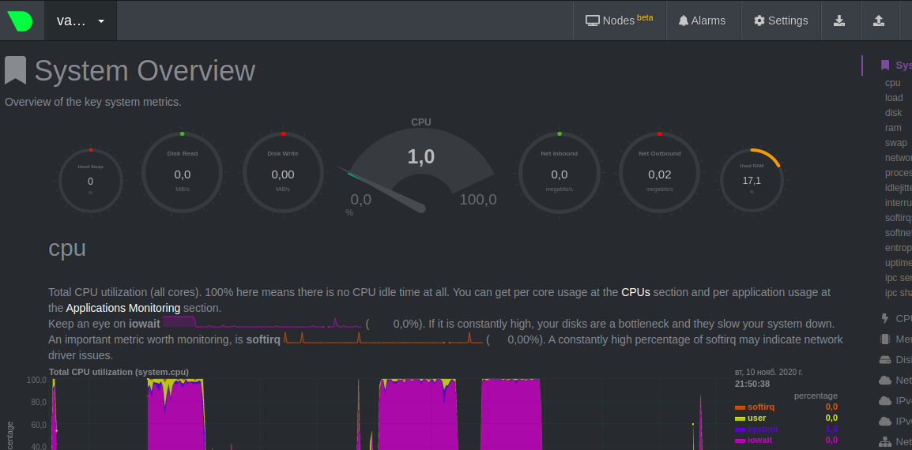
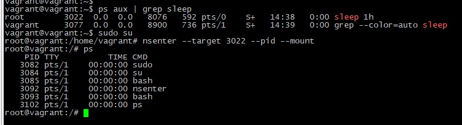

# Домашнее задание к занятию "3.4. Операционные системы, лекция 2"   
## Проценко Анастасия

1. Cоздала простой unit-файл node_exporter.service
```
[Unit]
Description=Node Exporter

[Service]
ExecStart=/opt/node_exporter/node_exporter $OPTIONS

[Install]
WantedBy=multi-user.target
```

Сервис стартует и перезапускается корректно: 

	1. Проверка после перезапуска работы процесса
	2. Остановка
	3. Проверка работы процесса
	4. Запуск процесса 
	5. Проверка работы процесса

2. CPU:
```
    node_cpu_seconds_total{cpu="0",mode="idle"} 
    node_cpu_seconds_total{cpu="0",mode="system"} 
    node_cpu_seconds_total{cpu="0",mode="user"} 
    process_cpu_seconds_total
```
    
Memory:
```
    node_memory_MemAvailable_bytes 
    node_memory_MemFree_bytes
```
    
Disk:
```
    node_disk_io_time_seconds_total{device="sda"} 
    node_disk_read_bytes_total{device="sda"} 
    node_disk_read_time_seconds_total{device="sda"} 
    node_disk_write_time_seconds_total{device="sda"}
```
Network:
```
    node_network_receive_errs_total{device="eth0"} 
    node_network_receive_bytes_total{device="eth0"} 
    node_network_transmit_bytes_total{device="eth0"}
    node_network_transmit_errs_total{device="eth0"}
```
	
3. В конфигурационный файл /etc/netdata/netdata.conf добавляем секцию [web] и параметр bind to = 0.0.0.0.

```
# NetData Configuration

# The current full configuration can be retrieved from the running
# server at the URL
#
#   http://localhost:19999/netdata.conf
#
# for example:
#
#   wget -O /etc/netdata/netdata.conf http://localhost:19999/netdata.conf
#

[global]
        run as user = netdata
        web files owner = root
        web files group = root
        # Netdata is not designed to be exposed to potentially hostile
        # networks. See https://github.com/netdata/netdata/issues/164
        bind socket to IP = 127.0.0.

[web]
   bind to = 0.0.0.0
```

   Метрики:
 
  
4. Судя по выводу dmesg - да: 
```
    root@vagrant:/etc/netdata# dmesg |grep virtualiz
[    0.002836] CPU MTRRs all blank - virtualized system.
[    0.074550] Booting paravirtualized kernel on KVM
```

5. 
```
root@vagrant:/etc/netdata# /sbin/sysctl -n fs.nr_open
1048576
```
1048576 - Это максимальное число открытых дескрипторов для ядра (системы).

Максимальный предел ОС можно посмотреть так :
```
root@vagrant:/etc/netdata# cat /proc/sys/fs/file-max
9223372036854775807
```

Мягкий лимит (так же ulimit -n)на пользователя:
```
root@vagrant:/etc/netdata# ulimit -Sn
1024
```

Жесткий лимит на пользователя:
```
root@vagrant:/etc/netdata# ulimit -Hn
1048576
```
6.  
7. `:(){ :|:& };:` - определяет функцию с именем : , которая порождает саму себя (дважды, один канал переходит в другой) и создает фон.

```
[ 3546.132659] cgroup: fork rejected by pids controller in /user.slice/user-1000.slice/session-11.scope
```

 В файле `/etc/systemd/system.conf`  можно ограничить дополнительно лимит.
 Если установить ulimit -u 50 - число процессов будет ограниченно 50 для пользователя. 
